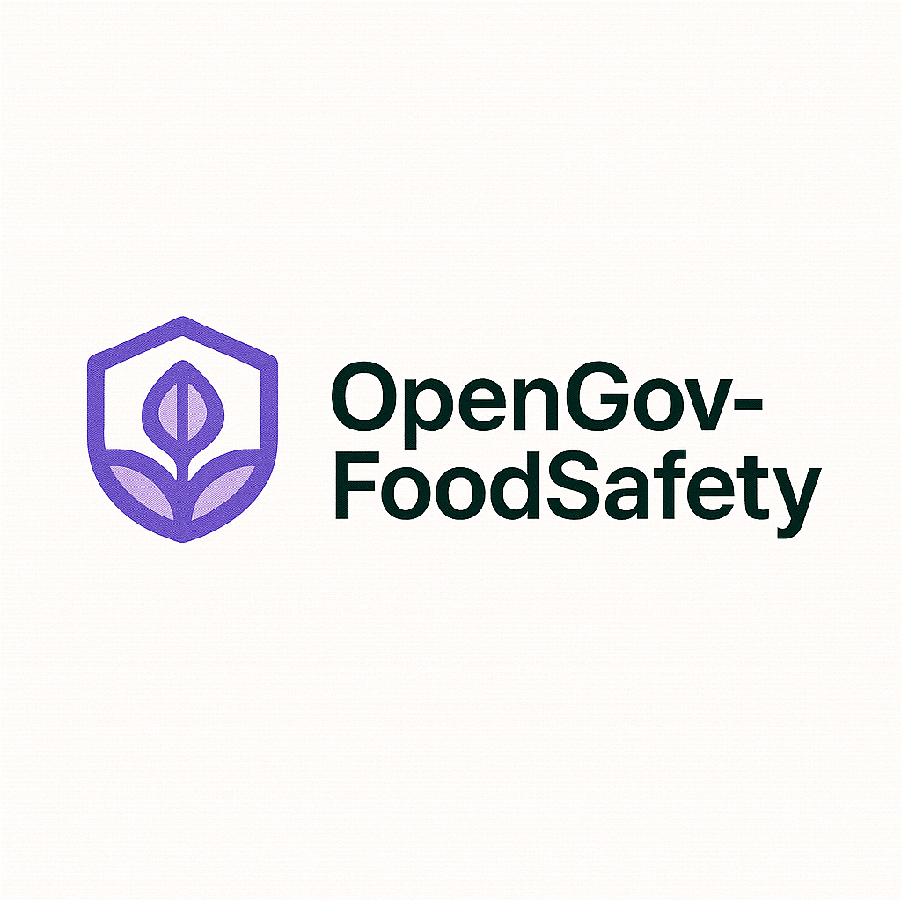

<div align="center">
  
</div>

# OpenGov-FoodSafety

**Comprehensive consumer protection and food safety inspection management system for environmental health departments across the United States**

[](https://opensource.org/licenses/MIT) [](https://python.org/downloads/) [](https://fastapi.tiangolo.com/) [](https://sqlalchemy.org/)

OpenGov-FoodSafety is a production-grade FastAPI application designed to support comprehensive consumer protection and food safety inspection management for environmental health departments across California counties. Built with modern async Python patterns, it provides a robust REST API with authentication, database management, and comprehensive testing.

## Key Features

- **FastAPI Framework**: Modern, fast web framework with automatic OpenAPI documentation
- **Async SQLAlchemy**: High-performance async database operations with SQLite
- **JWT Authentication**: Secure token-based authentication with bcrypt password hashing
- **AI-Powered Analysis**: OpenAI and Ollama integration for inspection analysis
- **Rich CLI Interface**: Professional command-line interface with Typer and Rich
- **Comprehensive Testing**: Full test coverage with pytest and async fixtures
- **Database Migrations**: Alembic support for schema versioning
- **100% Test Coverage**: Comprehensive pytest suite with async fixtures

## Table of Contents

- [Installation](#installation)
- [Quick Start](#quick-start)
- [API Documentation](#api-documentation)
- [Configuration](#configuration)
- [Development](#development)
- [Testing](#testing)
- [Deployment](#deployment)
- [Contributing](#contributing)
- [License](#license)
- [Support](#support)

## Installation

### Prerequisites

- Python 3.11 or higher
- pip or uv package manager

### Install Dependencies

```bash
# Clone the repository
git clone https://github.com/llamasearchai/OpenGov-FoodSafety.git
cd OpenGov-FoodSafety

# Create virtual environment
python -m venv .venv
source .venv/bin/activate  # On Windows: .venv\Scripts\activate

# Install dependencies
pip install -e .
```

## Quick Start

1. **Initialize the database**:
   ```bash
   # Initialize the database schema and seed sample data
   opengov-food db init
   opengov-food db seed
   ```

2. **Start the FastAPI server**:
   ```bash
   # Start the development server
   uvicorn opengovfood.web.app:app --reload
   ```

3. **Access the application**:
   - API: http://localhost:8000
   - Documentation: http://localhost:8000/docs
   - Health Check: http://localhost:8000/health

4. **Use the CLI**:
   ```bash
   # Show help
   opengov-food --help
   
   # Interactive menu
   opengov-food menu
   
   # Run AI analysis
   opengov-food agent run "Analyze restaurant hygiene compliance" --provider mock
   
   # Check system status
   opengov-food status overview
   ```

## API Documentation

The application provides comprehensive API documentation:

- **Interactive Docs**: http://localhost:8000/docs (Swagger UI)
- **ReDoc**: http://localhost:8000/redoc
- **OpenAPI Schema**: http://localhost:8000/openapi.json

### Example API Usage

```python
import httpx

# Login
response = httpx.post(
    "http://localhost:8000/api/v1/users/login/access-token",
    data={"username": "inspector@opengovfood.com", "password": "ChangeMe123"}
)
token = response.json()["access_token"]

# Create an item
headers = {"Authorization": f"Bearer {token}"}
item_data = {
    "title": "Weekly Inspection",
    "description": "Routine inspection workflow for downtown facilities"
}
response = httpx.post(
    "http://localhost:8000/api/v1/items/",
    json=item_data,
    headers=headers
)
print(response.json())
```

## Configuration

The application uses Pydantic settings for configuration. Create a `.env` file in the project root:

```env
# Database
SQLALCHEMY_DATABASE_URI=sqlite+aiosqlite:///./opengovfood.db

# Security
SECRET_KEY=your-secret-key-here
ACCESS_TOKEN_EXPIRE_MINUTES=10080

# AI Services
OPENAI_API_KEY=your-openai-api-key
OLLAMA_BASE_URL=http://localhost:11434
```

## Development

### Development Setup

```bash
# Install development dependencies
pip install -e ".[dev]"

# Run tests
pytest

# Run with coverage
pytest --cov=opengovfood --cov-report=html

# Format code
black src/
isort src/

# Type checking
mypy src/
```

### Project Structure

```
src/opengovfood/
├── __init__.py
├── cli.py                 # CLI interface
├── main.py               # Application entry point
├── api/                  # API endpoints
│   ├── __init__.py
│   ├── api.py
│   ├── deps.py
│   ├── items.py
│   └── users.py
├── core/                 # Core functionality
│   ├── __init__.py
│   ├── config.py         # Configuration
│   ├── database.py       # Database utilities
│   └── security.py       # Security utilities
├── crud/                 # Database operations
│   ├── __init__.py
│   ├── base.py
│   ├── item.py
│   └── user.py
├── models/               # SQLAlchemy models
│   ├── __init__.py
│   ├── base.py
│   ├── item.py
│   └── user.py
├── schemas/              # Pydantic schemas
│   ├── __init__.py
│   ├── item.py
│   ├── msg.py
│   ├── token.py
│   └── user.py
├── services/             # Business logic
│   ├── __init__.py
│   ├── agent_service.py
│   └── ollama_service.py
├── storage/              # Storage utilities
│   ├── __init__.py
│   └── item_storage.py
├── utils/                # Utility functions
│   ├── __init__.py
│   └── logging.py        # Logging configuration
└── web/                  # Web application
    ├── __init__.py
    └── app.py
```

## Testing

The application includes comprehensive test coverage with pytest:

```bash
# Run all tests
pytest

# Run with coverage
pytest --cov=opengovfood --cov-report=html

# Run specific test files
pytest tests/test_core.py
pytest tests/test_comprehensive.py
pytest tests/test_api.py
```

### Test Structure

- `tests/test_core.py` - Core functionality tests
- `tests/test_comprehensive.py` - Integration tests
- `tests/test_api.py` - API endpoint tests
- `tests/api/` - API-specific tests
- `tests/conftest.py` - Test configuration and fixtures

## Deployment

### Docker Deployment

```dockerfile
FROM python:3.11-slim

WORKDIR /app
COPY . .
RUN pip install -e .

EXPOSE 8000
CMD ["uvicorn", "opengovfood.web.app:app", "--host", "0.0.0.0", "--port", "8000"]
```

### Environment Variables

```env
ENVIRONMENT=production
SECRET_KEY=your-production-secret-key
OPENAI_API_KEY=your-openai-api-key
OLLAMA_BASE_URL=http://ollama:11434
```

## Contributing

We welcome contributions! Please see our [Contributing Guide](CONTRIBUTING.md) for details.

### Development Workflow

1. Fork the repository
2. Create a feature branch
3. Make your changes
4. Add tests for new functionality
5. Ensure all tests pass
6. Update documentation
7. Submit a pull request

## License

This project is licensed under the MIT License - see the [LICENSE](LICENSE) file for details.

## Support

- **Issues**: [GitHub Issues](https://github.com/llamasearchai/OpenGov-FoodSafety/issues)
- **Discussions**: [GitHub Discussions](https://github.com/llamasearchai/OpenGov-FoodSafety/discussions)
- **Email**: nikjois@llamasearch.ai