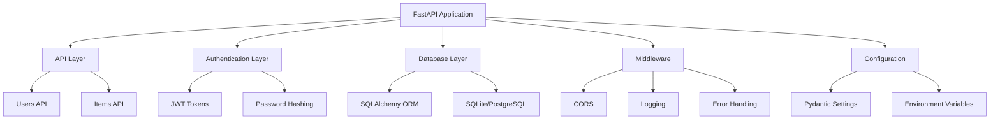
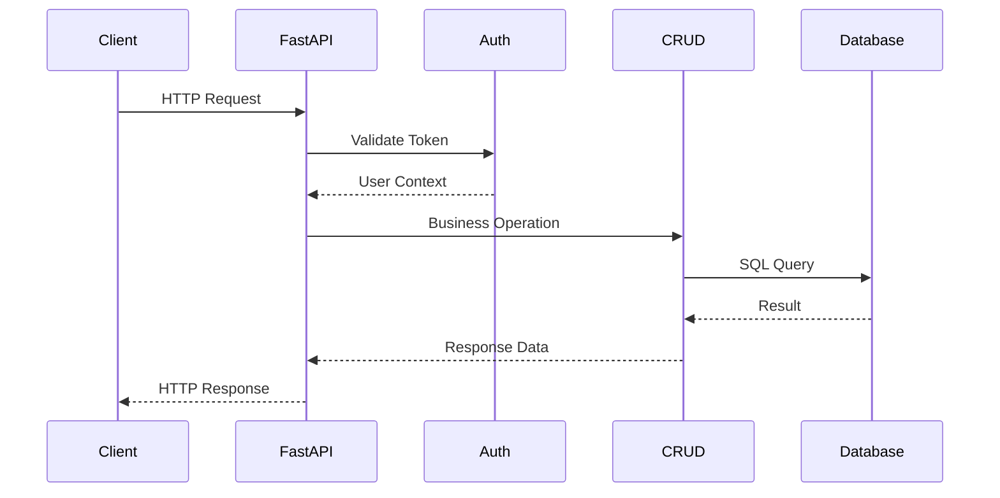
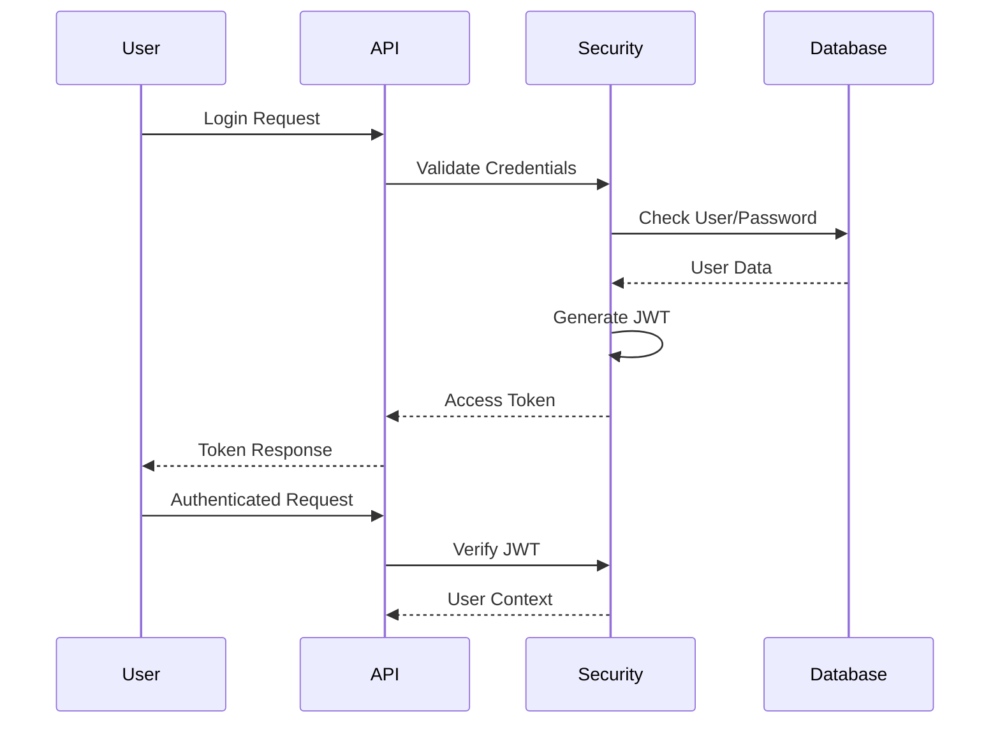
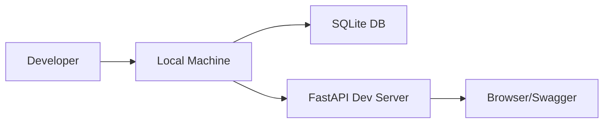
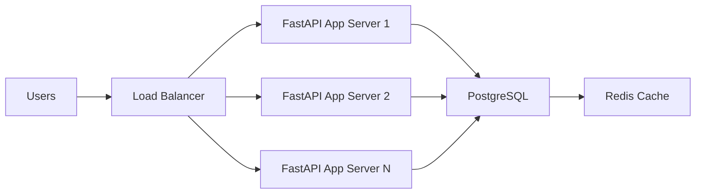

# System Architecture

OpenGov-Food is built with a modern, scalable architecture using FastAPI, async SQLAlchemy, and production-ready patterns.

## Architecture Overview



## Core Components

### 1. API Layer (FastAPI)

**Responsibilities:**
- HTTP request/response handling
- Route definition and validation
- OpenAPI documentation generation
- Dependency injection

**Key Features:**
- Async endpoint support
- Automatic request validation
- Interactive API documentation
- Type-safe request/response models

### 2. Authentication Layer

**Components:**
- JWT token generation and validation
- Password hashing with bcrypt
- User session management
- OAuth2 compatible endpoints

**Security Features:**
- Stateless JWT authentication
- Configurable token expiration
- Secure password storage
- Rate limiting protection

### 3. Database Layer

**Technology Stack:**
- SQLAlchemy 2.0 async ORM
- Async database sessions
- Connection pooling
- Migration management with Alembic

**Database Support:**
- SQLite (development/default)
- PostgreSQL (production)
- Async drivers (aiosqlite, asyncpg)

### 4. Business Logic Layer

**Structure:**
```
crud/          # Data access layer
├── user.py    # User operations
└── item.py    # Item operations

services/      # Business logic
├── agent_service.py
└── ollama_service.py
```

**Patterns:**
- Repository pattern for data access
- Service layer for business logic
- Dependency injection
- Async/await throughout

## Application Structure

```
opengovfood/
├── __init__.py
├── cli.py                 # Command-line interface
├── web/
│   ├── __init__.py
│   └── app.py            # FastAPI application
├── api/
│   ├── __init__.py
│   ├── api.py            # API router
│   ├── users.py          # Authentication endpoints
│   └── items.py          # Item CRUD endpoints
├── core/
│   ├── __init__.py
│   ├── config.py         # Application configuration
│   ├── database.py       # Database setup
│   └── security.py       # JWT and password utilities
├── crud/
│   ├── __init__.py
│   ├── user.py           # User database operations
│   └── item.py           # Item database operations
├── models/
│   ├── __init__.py
│   └── item.py           # SQLAlchemy models
├── services/
│   ├── __init__.py
│   ├── agent_service.py
│   └── ollama_service.py
├── storage/
│   ├── __init__.py
│   └── item_storage.py
├── utils/
│   ├── __init__.py
│   ├── logging.py
│   └── ...
└── tests/
    ├── conftest.py
    ├── test_api.py
    └── test_core.py
```

## Data Flow

### Request Flow



### Authentication Flow



## Database Design

### Schema Design

```sql
-- Users table
CREATE TABLE user (
    id INTEGER PRIMARY KEY,
    email VARCHAR UNIQUE NOT NULL,
    hashed_password VARCHAR NOT NULL,
    full_name VARCHAR NOT NULL,
    is_active BOOLEAN DEFAULT TRUE,
    created_at TIMESTAMP DEFAULT CURRENT_TIMESTAMP,
    updated_at TIMESTAMP
);

-- Items table
CREATE TABLE item (
    id INTEGER PRIMARY KEY,
    title VARCHAR(100) NOT NULL,
    description TEXT,
    status VARCHAR(20) DEFAULT 'pending',
    created_at TIMESTAMP DEFAULT CURRENT_TIMESTAMP,
    updated_at TIMESTAMP,
    owner_id INTEGER REFERENCES user(id)
);

-- Indexes
CREATE UNIQUE INDEX ix_user_email ON user(email);
CREATE INDEX ix_item_owner_id ON item(owner_id);
CREATE INDEX ix_item_status ON item(status);
```

### Relationships

- **One-to-Many**: User → Items
- **Foreign Keys**: Enforce referential integrity
- **Indexes**: Optimize query performance
- **Constraints**: Data validation at database level

## Security Architecture

### Authentication

- **JWT Bearer Tokens**: Stateless authentication
- **Password Hashing**: bcrypt with salt
- **Token Expiration**: Configurable timeout
- **Secure Headers**: CORS, security middleware

### Authorization

- **User Ownership**: Users can only access their own data
- **Role-Based Access**: Extensible for future roles
- **API Permissions**: Endpoint-level access control

### Data Protection

- **Input Validation**: Pydantic model validation
- **SQL Injection Prevention**: Parameterized queries
- **XSS Protection**: FastAPI automatic escaping
- **CSRF Protection**: Stateless JWT design

## Performance Considerations

### Async Architecture

- **Async Endpoints**: Non-blocking I/O operations
- **Connection Pooling**: Efficient database connections
- **Concurrent Requests**: Handle multiple users simultaneously
- **Resource Management**: Proper cleanup of connections

### Database Optimization

- **Indexes**: Optimized for common queries
- **Query Optimization**: Efficient SQL generation
- **Connection Pooling**: Reuse database connections
- **Lazy Loading**: Load related data as needed

### Caching Strategy

- **Response Caching**: Cache expensive operations
- **Database Query Caching**: Cache frequent queries
- **Static Asset Caching**: Cache CSS, JS, images

## Scalability

### Horizontal Scaling

- **Stateless Design**: No server-side sessions
- **Database Sharding**: Split data across servers
- **Load Balancing**: Distribute requests across instances
- **CDN Integration**: Static asset delivery

### Vertical Scaling

- **Resource Optimization**: Efficient memory usage
- **Database Tuning**: Query optimization and indexing
- **Async Processing**: Handle I/O bound operations
- **Background Tasks**: Offload heavy processing

## Deployment Architecture

### Development



### Production



### Containerized Deployment

```dockerfile
# Dockerfile
FROM python:3.11-slim

WORKDIR /app
COPY requirements.txt .
RUN pip install -r requirements.txt

COPY . .
EXPOSE 8000

CMD ["uvicorn", "opengovfood.web.app:app", "--host", "0.0.0.0", "--port", "8000"]
```

## Monitoring and Observability

### Logging

- **Structured Logging**: JSON format logs
- **Log Levels**: DEBUG, INFO, WARNING, ERROR
- **Request Logging**: Track API usage
- **Error Tracking**: Capture exceptions

### Metrics

- **Response Times**: API endpoint performance
- **Error Rates**: Track failures
- **Database Metrics**: Connection pools, query times
- **System Resources**: CPU, memory, disk usage

### Health Checks

- **Application Health**: `/health` endpoint
- **Database Connectivity**: Check DB connections
- **Dependency Status**: External service health

## Error Handling

### Global Exception Handling

```python
@app.exception_handler(HTTPException)
async def http_exception_handler(request, exc):
    return JSONResponse(
        status_code=exc.status_code,
        content={"detail": exc.detail}
    )

@app.exception_handler(RequestValidationError)
async def validation_exception_handler(request, exc):
    return JSONResponse(
        status_code=422,
        content={"detail": exc.errors()}
    )
```

### Error Response Format

```json
{
  "detail": "Error message",
  "type": "error_type",
  "timestamp": "2024-01-01T00:00:00Z"
}
```

## Future Architecture

### Microservices Migration

- **Service Decomposition**: Split into microservices
- **API Gateway**: Central request routing
- **Service Discovery**: Dynamic service location
- **Event-Driven**: Async communication between services

### Advanced Features

- **GraphQL API**: Flexible query interface
- **Real-time Updates**: WebSocket support
- **File Storage**: Document management
- **AI Integration**: ML model serving
- **Multi-tenancy**: Organization isolation