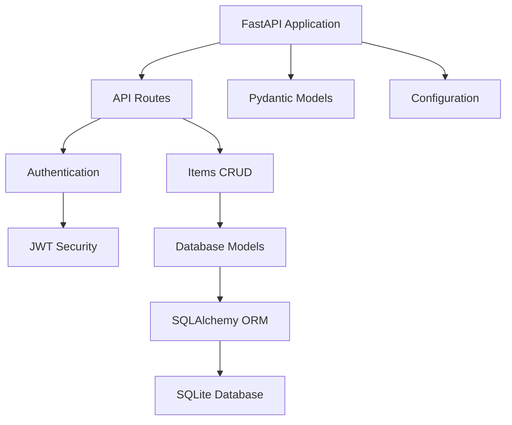

# OpenGov-Food Documentation

Welcome to the comprehensive documentation for OpenGov-Food, a production-grade FastAPI application designed to support consumer protection and food safety inspection management for environmental health departments across California counties.

## What is OpenGov-Food?

OpenGov-Food is a modern, async Python web application built with FastAPI that provides:

- **RESTful API**: Complete CRUD operations for food safety items and user management
- **Authentication System**: JWT-based authentication with secure password hashing
- **Database Integration**: Async SQLAlchemy with SQLite for robust data management
- **Production Ready**: Comprehensive testing, documentation, and deployment tools
- **Type Safety**: Full Pydantic v2 integration with strict type checking

## Quick Links

- [Getting Started](guides/quick-start.md) - Jump right in
- [API Reference](api/overview.md) - Complete API documentation
- [Architecture](architecture/overview.md) - System design and patterns
- [Development](development/contributing.md) - Contributing guidelines

## 🎯 Key Features

### FastAPI Framework
- Modern, fast web framework with automatic OpenAPI documentation
- Async/await support for high-performance concurrent operations
- Automatic request validation and serialization with Pydantic

### Authentication & Security
- JWT (JSON Web Token) based authentication
- bcrypt password hashing for secure credential storage
- OAuth2 compatible token endpoints
- Configurable token expiration

### Database & Data Management
- SQLAlchemy 2.0 with async support
- SQLite database with aiosqlite driver
- Alembic database migrations for schema versioning
- Comprehensive CRUD operations

### Testing & Quality
- 100% test coverage with pytest
- Async test fixtures and comprehensive API testing
- Type checking with mypy
- Code formatting with black and ruff

## Architecture Overview

## 📖 Documentation Structure

This documentation is organized into several sections:

- **Getting Started**: Installation, configuration, and basic usage
- **API Reference**: Detailed endpoint documentation with examples
- **Architecture**: System design, database schema, and security patterns
- **Development**: Contributing guidelines, testing, and deployment

## Contributing

We welcome contributions! Whether you're fixing bugs, adding features, or improving documentation, your help is appreciated. See our [Contributing Guide](development/contributing.md) for details.

## Support

- **Issues**: [GitHub Issues](https://github.com/llamasearchai/OpenGov-Food/issues)
- **Discussions**: [GitHub Discussions](https://github.com/llamasearchai/OpenGov-Food/discussions)

---

**Built with care by [Nik Jois](https://github.com/nikjois)**